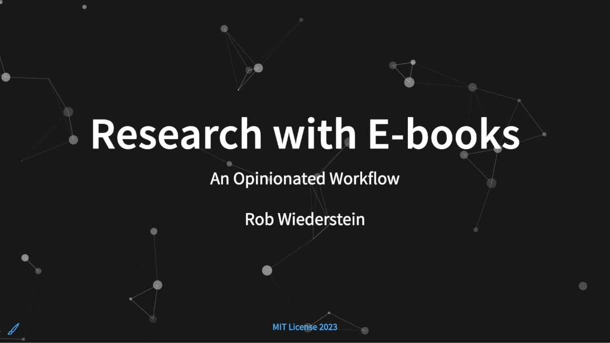

# Libby
<!--

-->

The libby repository holds a slide show on how to export e-book annotations in a tabular format.  By exporting in either csv or json, a reader's annotations can be used in data analysis projects and aid in content recall.

## Acknowledgements

- [RevealJS](https://revealjs.com)
- [Quarto](https://quarto.org)
- [Emil Hvitfeldt](https://github.com/EmilHvitfeldt/quarto-iframe-examples)
- [Kindle](https://www.amazon.com/b/?node=6669702011&tag=mh0b-20&hvadid=78546568761871&hvqmt=e&hvbmt=be&hvdev=c&ref=pd_sl_6itck04ygx_e)
- [Libby](https://www.overdrive.com/apps/libby)
- [Bookcision](https://readwise.io/bookcision)
- [Zotero](https://www.zotero.org)
- [Zotfile](http://zotfile.com/#how-to-install--set-up-zotfile)
- [Research Rabbit](https://www.researchrabbit.ai)
- [tsParticles](https://particles.js.org)

## Additional Resources

- [How To Use Zotero (A Complete Beginner's Guide)](https://www.youtube.com/watch?v=JG7Uq_JFDzE).
- [Research Rabbit & Zotero Sync](https://www.youtube.com/watch?v=6vVcqwdpfK0) by Bryan Jenks.
- [Zotero Obsidian Integration](https://www.youtube.com/watch?v=CGGeMrtyjBI).
